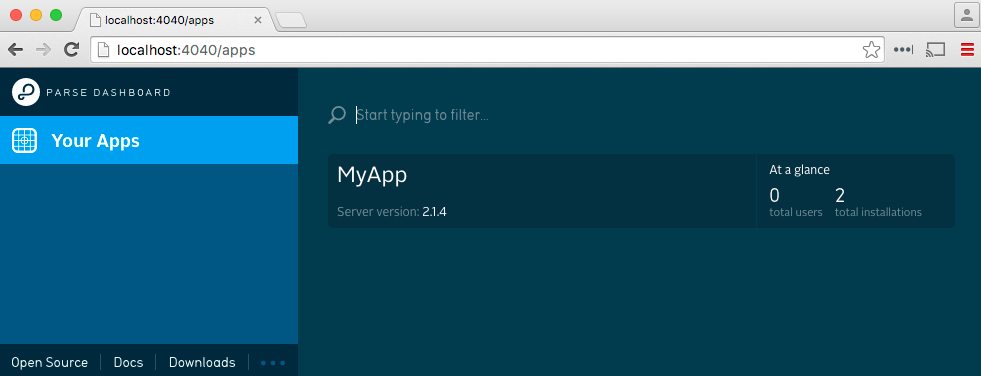

# Parse Dashboard

Parse Dashboard is standalone dashboard for managing your Parse apps. You can use it to manage your [Parse Server](https://github.com/ParsePlatform/parse-server) apps and your apps that are running on [Parse.com](https://Parse.com).

## Getting Started

[Node.js](https://nodejs.org) version >= 4.3 is required to run the dashboard. Once you have Node you can install the dashboard by cloning this repo and running `npm install`.

```
git clone git@github.com:ParsePlatform/parse-dashboard.git
cd parse-dashboard
npm install
```

Next add your app info into `parse-dashboard/Parse-Dashboard/parse-dashboard-config.json`. The file should match the following format, using the server URL, App ID, and Master Key from your Parse Server. The App Name can be anything you want, and is used to reference your app in the dashboard. **Make sure the server URL is a URL that can be accessed by your browser.**

```
{
  "apps": [
    {
      "serverURL": "http://localhost:1337/parse",
      "appId": "myAppId",
      "masterKey": "myMasterKey",
      "appName": "MyApp"
    }
  ]
}
```

Ensure your Parse Server version is `>= 2.1.4`. The dashboard will not work with Parse Server instances with lower versions.

You can also manage your apps that are hosted on Parse.com from the same dashboard. For these apps, you must specify your rest key and javascript key, and set your server url to https://api.parse.com/1.

```
{
  "apps": [
    {
      "serverURL": "https://api.parse.com/1",
      "appId": "myAppId",
      "masterKey": "myMasterKey",
      "javascriptKey": "myJavascriptKey",
      "restKey": "myRestKey",
      "appName": "My Parse.Com App"
    },
    {
      "serverURL": "http://localhost:1337/parse",
      "appId": "myAppId",
      "masterKey": "myMasterKey",
      "appName": "My Parse Server App"
    }
  ]
}
```

Then execute `npm run dashboard` and visit [`http://localhost:4040`](http://localhost:4040) and you will be able to manage your parse apps.



## Other options

You can set `appNameForURL` for each app to control the url of your app within the dashboard.

If you want to require a username and password to access the dashboard, you can do so by adding usernames and passwords for HTTP Basic Auth to your configuration file:

```
{
  "apps": [...],
  "users": [
    {
      "user":"user1",
      "pass":"pass"
    },
    {
      "user":"user2",
      "pass":"pass"
    }
  ]
}
```

HTTPS and Basic Auth are mandatory if you are accessing the dashboard remotely instead of accessing it from `localhost`.

## Run with Docker

It is easy to use it with Docker. First build the image:

```  
docker build -t parse-dashboard .
```

Run the image with your ``config.json`` mounted as a volume

```
docker run -d -p 8080:4040 -v host/path/to/config.json:/src/Parse-Dashboard/parse-dashboard-config.json parse-dashboard 
```

By default, the container will start the app at port 4040 inside the container. However, you can run custom command as well (see ``Deploying in production`` for custom setup). 

In this example, we want to run the application in production mode at port 80 of the host machine.

```
docker run -d -p 80:8080 -v host/path/to/config.json:/src/Parse-Dashboard/parse-dashboard-config.json parse-dashboard --port 8080
```

If you are not familiar with Docker, ``--port 8080`` with be passed in as argument to the entrypoint to form the full command ``npm start -- --port 8080``. The application will start at port 8080 inside the container and port ``8080`` will be mounted to port ``80`` on your host machine.

## Deploying in production

If you're deploying to a provider like Heroku, or Google App Engine, the SSL endpoint is terminated early and handled by the provider and you may encounter this error: `Parse Dashboard can only be remotely accessed via HTTPS`. 

:warning: :warning: Before going further, make sure your server **cannot** be reachable via **HTTP**. See the provider documentation for force HTTPS connections to your deployment.

Set the environment variable `PARSE_DASHBOARD_ALLOW_INSECURE_HTTP=1` to tell parse server to skip the secure tests.

To start your server use:

`$ npm start`

Optionally you can use the command line arguments:

`$ npm start -- --config path/to/config.json --port 8080 --allowInsecureHTTP=1`

Or update you start script with the accoring configuration.

All paramters are optional and their default values are:


	config: parse-dashboard/Parse-Dashboard/parse-dashboard-config.json
	port: 4040
	allowInsecureHTTP: false


## Contributing

We really want Parse to be yours, to see it grow and thrive in the open source community. Please see the [Contributing to Parse Dashboard guide](CONTRIBUTING.md).
